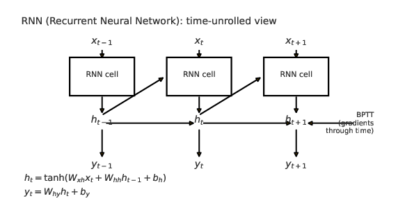
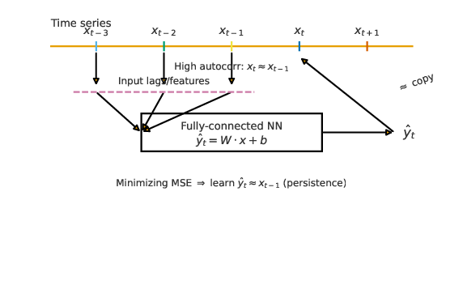

#+TITLE: LSTMと時系列データ処理
#+SETUPFILE: options/default.org
#+OPTIONS: num:1

* python基本文法

時系列データの多くはpandasというライブラリを使って扱われる

#+BEGIN_SRC python -n -r -l  :tangle "dyn/examples/pdbasic.py" 
# pip3 install pandas
import pandas as pd

# 辞書からDataFrameを作成
data = {
    "名前": ["Alice", "Bob", "Charlie", "David"],
    "年齢": [24, 30, 18, 35],
    "点数": [85, 92, 78, 88]
}

df = pd.DataFrame(data)
print(df)

#      名前  年齢  点数
#0   Alice  24  85
#1     Bob  30  92
#2  Charlie  18  78
#3   David  35  88
#+END_SRC

sin波をpandasのデータとして格納
#+BEGIN_SRC python -n -r -l  :tangle "dyn/examples/pdsin.py"
import numpy as np
import pandas as pd
time = np.arange(0, 200, 0.1)
data = np.sin(time) + 0.1 * np.random.randn(len(time))  # sin波+ノイズ

df = pd.DataFrame({"time": time, "value": data})
df.set_index("time", inplace=True)

import matplotlib.pyplot as plt
df.plot()
plt.show()
#+END_SRC

* リカレントニューラルネットワーク

リカレントニューラルネットワーク(RNN)

#+CAPTION: RNN の時間展開と BPTT のイメージ
#+NAME: fig:rnn
#+ATTR_LATEX: :width 0.9\linewidth :placement [H]
#+ATTR_HTML: :width 90%

** BPTT(Backpropagation Through Time)とは

[[https://xexeq.jp/blogs/media/it-glossary234][BPTTとは、リカレントニューラルネットワーク（RNN）の学習アルゴリズムです。時系列データの処理に適した手法で、過去の情報を考慮しながら現在の出力を計算します。BPTTは通常の誤差逆伝播法を時間方向に拡張したものであり、RNNの重みを効率的に更新できます。]]

* sin関数をニューラルネットに学習させてみる

file:dyn/examples/lstmsin.py
#+BEGIN_SRC python -n -r -l  :tangle "dyn/examples/lstmsin.py" 
import numpy as np
import pandas as pd
import torch
import torch.nn as nn
from torch.utils.data import Dataset, DataLoader
import matplotlib.pyplot as plt

# ==== 1. ダミー時系列データを作る（sin波） ====
np.random.seed(0)
time = np.arange(0, 200, 0.1)
data = np.sin(time) + 0.1 * np.random.randn(len(time))  # sin波+ノイズ

df = pd.DataFrame({"time": time, "value": data})
df.set_index("time", inplace=True)

# ==== 2. 学習・テスト分割 ====
train_size = int(len(df) * 0.8)
train_series = df.iloc[:train_size]["value"]
test_series = df.iloc[train_size:]["value"]

SEQ_LEN = 20 ##この変数の意味？

class TimeSeriesDataset(Dataset):
    def __init__(self, series, seq_len=20):
        self.series = torch.tensor(series.values, dtype=torch.float32)
        self.seq_len = seq_len

    def __len__(self):
        return len(self.series) - self.seq_len

    def __getitem__(self, idx):
        x = self.series[idx:idx+self.seq_len].unsqueeze(-1)  # (seq_len,1)
        y = self.series[idx+self.seq_len]
        return x, y

train_dataset = TimeSeriesDataset(train_series, SEQ_LEN)
test_dataset = TimeSeriesDataset(test_series, SEQ_LEN)

train_loader = DataLoader(train_dataset, batch_size=32, shuffle=True)

# ==== 3. LSTMモデル定義 ====
class LSTMModel(nn.Module):
    def __init__(self, input_size=1, hidden_size=50, num_layers=1):
        super().__init__()
        self.lstm = nn.LSTM(input_size, hidden_size, num_layers,
                            batch_first=True ###ここに注意
                            )
        self.fc = nn.Linear(hidden_size, 1)  ###ここの意味は？

    def forward(self, x):
        out, _ = self.lstm(x)
        out = out[:, -1, :]   # 最後の時点だけ出力する
        out = self.fc(out)
        return out.squeeze()

model = LSTMModel()
criterion = nn.MSELoss()
optimizer = torch.optim.Adam(model.parameters(), lr=0.01) ##Adamになっているのに注意

# ==== 4. 学習 ====
EPOCHS = 10
for epoch in range(EPOCHS):
    for x, y in train_loader:
        optimizer.zero_grad()
        pred = model(x)
        loss = criterion(pred, y)
        loss.backward()
        optimizer.step()
    print(f"Epoch {epoch+1}/{EPOCHS}, Loss: {loss.item():.4f}")

# ==== 5. テストデータで予測 ====
model.eval() #ここも注意
preds = []
with torch.no_grad(): #ここも注意
    for i in range(len(test_dataset)):
        x, _ = test_dataset[i]
        x = x.unsqueeze(0)  # (1, seq_len, 1)
        pred = model(x).item()
        preds.append(pred)

# ==== 6. グラフ表示 ====
plt.figure(figsize=(12,6))
plt.plot(test_series.index[SEQ_LEN:], test_series.values[SEQ_LEN:], label="True", color="blue")
plt.plot(test_series.index[SEQ_LEN:], preds, label="Predicted", color="red")
plt.title("LSTM Prediction vs True values")
plt.xlabel("Time")
plt.ylabel("Value")
plt.legend()
plt.show()
#+END_SRC

- [[https://ja.wikipedia.org/wiki/%E9%95%B7%E3%83%BB%E7%9F%AD%E6%9C%9F%E8%A8%98%E6%86%B6][LSTMとは]] 

- [[https://docs.pytorch.org/docs/stable/generated/torch.nn.LSTM.html][LSTMのpytochのドキュメント]]

* googleトレンドをニューラルネットに学習させてみる

以下は日経225という単語のgoogleトレンドをニューラルネットに学生させる例。

うまくいかない場合は

file:trend.csv

をダウンロードして使うか、KEYWORDを違うものに変える。

ナスダックの株価について同様のことを行う例もコメントアウトされているので、それも試してみる。

file:dyn/examples/lstmtrand.py
#+BEGIN_SRC python -n -r -l  :tangle "dyn/examples/lstmtrand.py"

# =========================
# 1) ライブラリ
# =========================
# pip3 install pytrends torch matplotlib pandas scikit-learn

from pytrends.request import TrendReq
import pandas as pd
import numpy as np
import matplotlib.pyplot as plt

import torch
import torch.nn as nn
from torch.utils.data import Dataset, DataLoader
from sklearn.preprocessing import StandardScaler

# =========================
# 2) Googleトレンドからデータ取得
# =========================
#KEYWORD = "Bitcoin"          # ←好きな単語に変更（日本語OK）
KEYWORD = "日経225"          # ←好きな単語に変更（日本語OK）

GEO = "JP"                   # 地域（"JP","US",""=全世界 など）
TIMEFRAME = "today 5-y"      # 期間（例: "today 12-m", "today 5-y", "2019-01-01 2025-10-01"）

pytrends = TrendReq(hl='ja-JP', tz=540)  # 日本時間
pytrends.build_payload([KEYWORD], timeframe=TIMEFRAME, geo=GEO)
df_trend = pytrends.interest_over_time()

df_trend.to_csv('trend.csv')

##### googleトレンドが反応ない場合はこれに切り替える
#df_trend=pd.read_csv('trend.csv', index_col=0)
#df_trend.index=pd.to_datetime(df_trend.index)

# 取得結果の整形
if df_trend.empty:
    raise ValueError("Googleトレンドからデータが取得できませんでした。キーワード/期間/地域を見直してください。")

# isPartial列を削除して、欠損を前方埋め
series = df_trend[KEYWORD].copy()
series = series.asfreq(series.index.inferred_freq) if series.index.inferred_freq else series
#print(series)

##### googleトレンドではなく株価も同様に処理できる
#import yfinance as yf
#ticked = yf.Ticker("^NDX")
###hist = ticked.history(period="100d",interval="1d")
#hist = ticked.history(period="max",interval="1d")
#series=hist['Close']
##print(series)

series = series.ffill()
series.name = "value"

# =========================
# 3) 前処理（標準化＆学習/テスト分割）
# =========================
# 学習80% / テスト20%
n = len(series)
train_size = int(n * 0.8)
train_idx_end = train_size

train_series = series.iloc[:train_idx_end]
test_series  = series.iloc[train_idx_end:]

#print(train_series.shape)
#print(test_series.shape)

# 標準化（学習データでfit → 両方にtransform）
scaler = StandardScaler()
train_vals = scaler.fit_transform(train_series.values.reshape(-1, 1)).flatten()
test_vals  = scaler.transform(test_series.values.reshape(-1, 1)).flatten()

# =========================
# 4) PyTorch Dataset
# =========================
SEQ_LEN = 24  # 1ステップ予測用の履歴長（週次なら~半年、日次なら約1ヶ月）

#### 以前に使ったTimeSeriesDataset(Dataset)との違いに注目(やっていることはほぼ同じだけど、もし後で拡張しようとすると)
class SeqDataset(Dataset):
    def __init__(self, arr, seq_len=24):
        self.x = []
        self.y = []
        for i in range(len(arr) - seq_len):
            self.x.append(arr[i:i+seq_len])
            self.y.append(arr[i+seq_len])
        self.x = torch.tensor(np.array(self.x), dtype=torch.float32).unsqueeze(-1) # (N, seq_len, 1)
        self.y = torch.tensor(np.array(self.y), dtype=torch.float32)               # (N,)

    def __len__(self):
        return len(self.y)

    def __getitem__(self, idx):
        return self.x[idx], self.y[idx]

train_ds = SeqDataset(train_vals, SEQ_LEN)
test_ds  = SeqDataset(test_vals,  SEQ_LEN)

train_loader = DataLoader(train_ds, batch_size=32, shuffle=True)

##ここは以前と同じ
class LSTMModel(nn.Module): 
    def __init__(self, input_size=1, hidden_size=50, num_layers=1):
        super().__init__()
        self.lstm = nn.LSTM(input_size, hidden_size, num_layers,
                            batch_first=True ###ここに注意
                            )
        self.fc = nn.Linear(hidden_size, 1)  ###ここの意味は？
    def forward(self, x):
        out, _ = self.lstm(x)  # (B, T, H)
        out = out[:, -1, :]   # 最後の時点だけ出力する
        out = self.fc(out)   # (B, 1)
        return out.squeeze() # (B,)

    

device = torch.device("cuda" if torch.cuda.is_available() else "cpu")
model = LSTMModel(hidden_size=64, num_layers=1).to(device)

criterion = nn.MSELoss()
optimizer = torch.optim.Adam(model.parameters(), lr=1e-3) ##Adamになっているのに注意

# =========================
# 6) 学習
# =========================
EPOCHS = 15
model.train()
for epoch in range(EPOCHS):
    epoch_loss = 0.0
    for x, y in train_loader:
        x = x.to(device)
        y = y.to(device)

        optimizer.zero_grad()
        pred = model(x)
        loss = criterion(pred, y)
        loss.backward()
        optimizer.step()
        epoch_loss += loss.item() * x.size(0)

    print(f"Epoch {epoch+1}/{EPOCHS}  loss={epoch_loss/len(train_ds):.4f}")

# =========================
# 7) テストデータで 1ステップ予測
# =========================
model.eval()
pred_scaled = []
with torch.no_grad():
    for i in range(len(test_ds)):
        x, _ = test_ds[i]
        x = x.unsqueeze(0).to(device)  # (1, T, 1)
        yhat = model(x).cpu().item()
        pred_scaled.append(yhat)

# 逆標準化（スカラーに対して inverse_transform を使えるように2次元化）
pred_scaled_arr = np.array(pred_scaled).reshape(-1, 1)
pred_inv = scaler.inverse_transform(pred_scaled_arr).flatten()

# 真値（テスト部分のうち、SEQ_LEN 以降が予測対象）
true_inv = test_series.values[SEQ_LEN:]

# 対応するインデックス
plot_index = test_series.index[SEQ_LEN:]

# =========================
# 8) プロット（真値 vs 予測）
# =========================
plt.figure(figsize=(12, 6))
plt.plot(plot_index, true_inv, label="True")
plt.plot(plot_index, pred_inv, label="Predicted")
plt.title(f"Google Trends: {KEYWORD}  — LSTM Prediction vs True")
plt.xlabel("Date")
plt.ylabel("Trend index (0–100)")
plt.legend()
plt.tight_layout()
plt.show()

# =========================
# 9)（おまけ）数ステップ先の再帰予測（テスト末尾から先へ）
# =========================
# 直近の実データ（学習+テストの最後のSEQ_LEN点）を使って、kステップ先まで再帰的に予測
K_STEPS = 12
hist_full = scaler.transform(series.values.reshape(-1,1)).flatten()
window = hist_full[-SEQ_LEN:].copy()

future_scaled = []
model.eval()
with torch.no_grad():
    for _ in range(K_STEPS):
        xin = torch.tensor(window, dtype=torch.float32).view(1, SEQ_LEN, 1).to(device)
        yhat = model(xin).cpu().item()
        future_scaled.append(yhat)
        # 窓を1つ進める
        window = np.concatenate([window[1:], [yhat]])

future = scaler.inverse_transform(np.array(future_scaled).reshape(-1,1)).flatten()
future_index = pd.date_range(series.index[-1], periods=K_STEPS+1, freq=series.index.inferred_freq)[1:]

plt.figure(figsize=(12, 4))
plt.plot(series.index[-100:], series.values[-100:], label="History (last 100)")
plt.plot(future_index, future, label=f"Recursive forecast (+{K_STEPS})")
plt.title(f"Google Trends: {KEYWORD} — Recursive Forecast")
plt.xlabel("Date")
plt.ylabel("Trend index (0–100)")
plt.legend()
plt.tight_layout()
plt.show()
  
#+END_SRC

* ラグ特徴のコピー現象

強い自己相関を持つ時系列を単純な全結合ニューラルネットで学習すると，
前回値をそのままコピーするような予測をしてしまう。

#+CAPTION: 単純なラグ特徴を単純なNNが「コピー」してしまう仕組み
#+NAME: fig:copy-effect
#+ATTR_LATEX: :width 0.9\linewidth :placement [H]
#+ATTR_HTML: :width 80%

* 演習
- 適当なpandasで保存したデータをファイルに保存して、再度ファイルから読み込んで同じデータが入っているか確認せよ（ヒント https://note.nkmk.me/python-pandas-to-pickle-read-pickle/ ）。
- 自分が興味ある単語のgoogleトレンドを学習させてみよう
- 「kステップ先まで再帰的に予測」の部分で再帰的な計算がなぜ必要なのか考察せよ
- 学習したニューラルネットワークをファイルに保存して、再度ファイルから読み込んで、同じ予測結果となることを確認せよ(ヒント state_dict の保存について調べよ https://docs.pytorch.org/tutorials/beginner/saving_loading_models.html )。

  
* 課題

- LSTMの数式を良く見て input_size=1, hidden_size=50, num_layers=1 がどれでに対応しているのか理解せよ。
- df_trend は一日ごとにデータがまとめられているが、一週間ごとのデータに変換してみよ
- 複数の単語のgoogleトレンドを学習させてみよう。例えば「高専」「大学」の２つのトレンドから「高専」のトレンドを予測させる。
- 複数の入力があるLSTMが、どれをを重視しているのか調べてみよう。例えば「高専」「大学」の２つのトレンドから「高専」のトレンドを予測させる場合に、どちらからの入力が重要とみなされているか？学習したニューラルネットの重みを見ればわかるはずだが、この重みを取り出すプログラムはどう作る？(ヒント)

* 発展課題

- [[https://docs.pytorch.org/docs/stable/generated/torch.nn.LSTM.html][LSTMのpytochのドキュメント]] を見るとLSTM以外にもGRUや、RNNなど様々なユニットがが見える。これらについて調べて、実際にユニットを組み合わせて動かしてみよう。

- [[https://docs.pytorch.org/docs/stable/generated/torch.nn.Transformer.html][Transformer]] というユニットはChatGPTのメインとなる構成部品となっている。これについて調べてよ。実際に動かしてみよう。LSTMなどと組み合わせた構成も試してみよ。

- 様々な株の15分足  http://10.133.2.200/ai/out.csv.zip  を使って、ナスダック100が翌日に値上がりするか値下がりするか予想するプログラムをLSTMを使って作成せよ。
